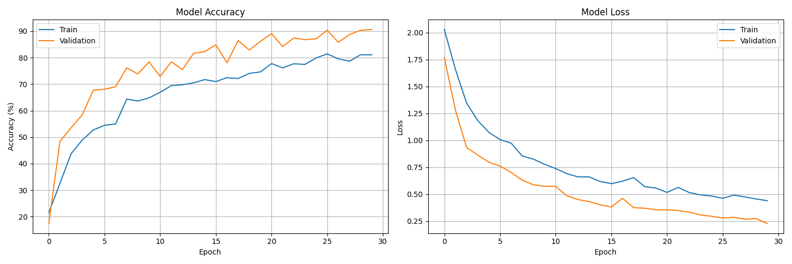
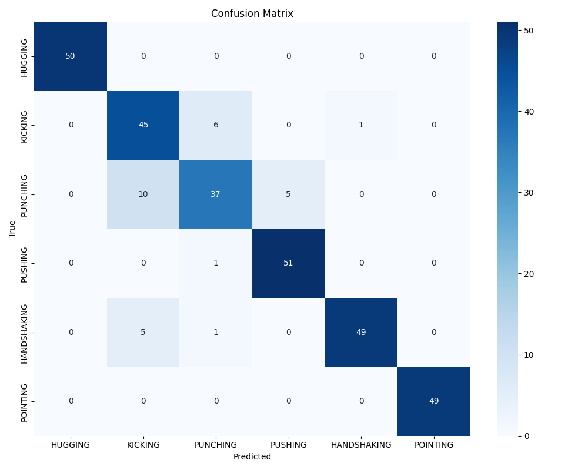

# Human Action Recognition using CNN-LSTM

This project implements a human action recognition system using a hybrid CNN-LSTM architecture. The model is capable of recognizing six different human actions: HUGGING, KICKING, PUNCHING, PUSHING, HANDSHAKING, and POINTING.

## Features

- Hybrid CNN-LSTM architecture with attention mechanism
- Real-time video processing capabilities
- Support for multiple video formats
- Advanced feature extraction using optical flow
- Visualization tools for model performance analysis

## Project Structure

```
Human-Action-Recognition-CNN-LSTM/
├── notebooks/             # Jupyter notebooks
├── output/                # Model outputs and visualizations
│   ├── training_history.png     # Training progress visualization
│   ├── confusion_matrix.png     # Model performance analysis
│   ├── class_distribution.png   # Dataset class distribution
│   └── processed_videos/        # Video outputs with predictions
├── data/                  # Data directory
│   ├── videos/           # Input video files
│   └── csv/              # CSV files with extracted features
└── requirements.txt       # Project dependencies
```

## Setup and Installation

1. Clone the repository:
```bash
git clone https://github.com/salahradwan2210/Human-Action-Recognition-CNN-LSTM.git
cd Human-Action-Recognition-CNN-LSTM
```

2. Install dependencies:
```bash
pip install -r requirements.txt
```

## Output Directory Structure

The `output` directory will contain files generated during training and testing:

### Visualization Files
The following files will be automatically generated when running the model:
- `training_history.png`: Shows training and validation accuracy/loss over epochs
- `confusion_matrix.png`: Displays model's classification performance
- `class_distribution.png`: Shows distribution of samples across classes

### Video Processing
When you run the model on a video file:
1. Place your input videos in the `data/videos` directory
2. Run the model using the notebook
3. Processed videos will be automatically saved in `output/processed_videos/`
   - Each output video will include:
     - Original video frames
     - Real-time action predictions
     - Confidence scores
     - Action descriptions

Example output filename format:
- Input: `data/videos/input_video.mp4`
- Output: `output/processed_videos/output_input_video.mp4`

## Model Performance

### Training History

The training history shows the model's learning progress over epochs, with both training and validation metrics. The final model achieved:
- Training Accuracy: 84.56%
- Validation Accuracy: 92.90%
- Best Validation Accuracy: 93.23%

### Confusion Matrix

The confusion matrix shows the model's classification performance across all action classes. Notable results:
- Perfect accuracy (100%) for HUGGING and POINTING actions
- Strong performance (>90%) for PUSHING and HANDSHAKING
- Good discrimination between similar actions

### Class Distribution

The class distribution plot shows the balance of samples across different action classes in both training and testing sets.

## Model Architecture

The model uses a hybrid architecture combining:
- CNN layers for spatial feature extraction
- Bidirectional GRU for temporal feature processing
- Attention mechanism for focusing on important features
- Deep classifier with skip connections

## Results

The model achieves significant accuracy in recognizing human actions:
- Overall Accuracy: 93%
- Macro Average F1-Score: 0.93
- Perfect Recognition (100%) for HUGGING and POINTING actions
- Strong Performance (>90%) for most other actions

### Per-Class Performance:
```
              precision    recall  f1-score   support
     HUGGING       1.00      1.00      1.00        50
     KICKING       0.79      0.94      0.86        52
    PUNCHING       0.93      0.75      0.83        52
     PUSHING       0.91      0.98      0.94        52
 HANDSHAKING       0.98      0.91      0.94        55
    POINTING       1.00      1.00      1.00        49
```

## License

This project is licensed under the MIT License - see the LICENSE file for details. 
